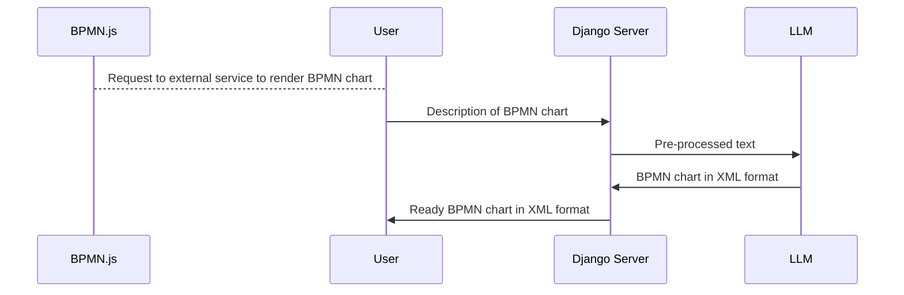

# Diagrams-AI

```mermaid
sequenceDiagram
BPMN.js --> User: Request to external service to render BPMN chart
User ->> Django Server: Description of BPMN chart
Django Server ->> LLM: Pre-processed text
LLM ->> Django Server: BPMN chart in XML format
Django Server ->> User: Ready BPMN chart in XML format
```

## Tech Stack
