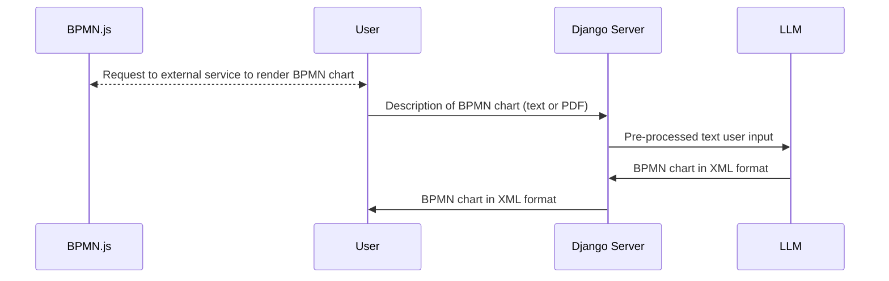
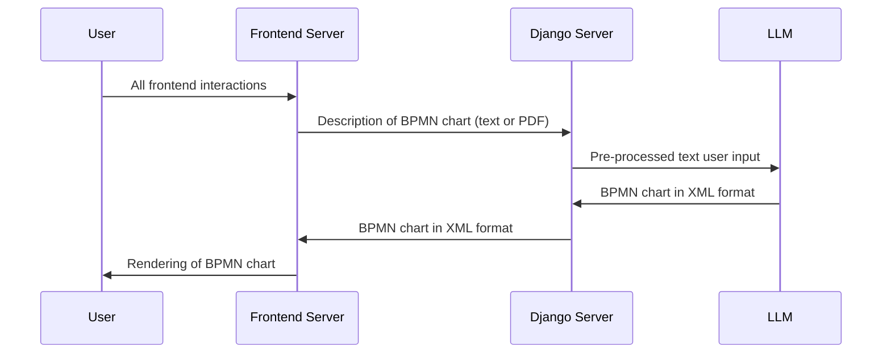

# Diagrams-AI

### External BPMN rendering

### In-app BPMN rendering with separate front-end server

## Tech Stack
 - Backend:
    - Python
    - Flask/Django
    - Pytest, Unittest
    - Docker
 - Frontend:
    - HTML
    - CSS
    - JavaScript
    - BPMN.js

 ## Roles in the project:
  - Dawid Stasiński:
    - Project Manager
    - IT Architekt
    - Developer
    - Tester
 - Bruno Maruwka:
    - Test Manager
    - Developer
    - Tester
 - Mateusz Wójcicki:
    - Business Analyst
    - Developer
    - Tester

## Rescources:
 - [Free LLM API Resources](https://github.com/cheahjs/free-llm-api-resources)
 - [BPMN.js](https://bpmn.io/toolkit/bpmn-js/)